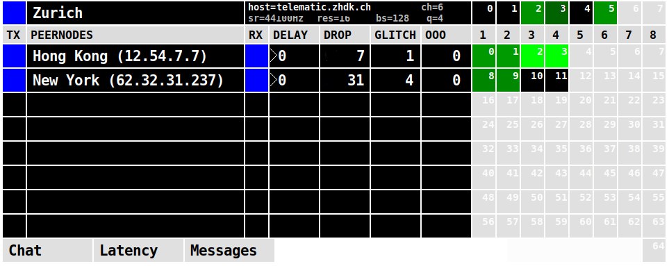

tpf-client
==========

About
-----

tpf-client is a low-latency multi-channel audio transmission software
based on the jacktrip protocol and built in Pure Data.

It tries to overcome some limitations that are often encountered
when using the traditional jacktrip commandline utility:

 * No need for clients to run with a public IP address and no need
   for setting up port-forwarding on the client side.

 * The tpf-client reduces complexity when configuring a session
   with many endpoints.

The client registers itself to a tpf-server which keeps track
of the connected clients. While connected to the server, clients
establish a jacktrip audio connection to their peers either by
routing the audio packets through the tpf-server (a UDP-proxy running
on a separate port) or directly to their peers by employing a
technique called UDP hole punching (https://en.wikipedia.org/wiki/UDP_hole_punching).

You can download the client from:

  https://github.com/zhdk/tpf-client

The server software is hosted separately at:

  https://github.com/zhdk/tpf-server

Depending on the locations of the endpoints it is advised to
run a server closer to one of the endpoints in order to
keep transmission latency low.

#### Scope

tpf-client doesn't have any mixing, levelling, routing capabilities. It is meant
as a pure transmission utility. For concerts and experiments, we usually interface
it with a DAW like Ardour. Further instructions and Ardour template sessions are in
progress and will be provided.

Prerequisites
-------------

Make sure to get the latest Pure Data from:

  https://puredata.info/downloads/

You need the following externals to run tpf-client
  * iemnet
  * osc
  * slip

You can install externals through the Pd menu:
'Help' -> 'Find Externals'

Running the client
------------------

#### Run
To run the client, open the patch tpf-client.pd in Pure Data. Typically,
you run Pd with JACK as audio backend, so that you can send audio from
and to the tpf-client to other software. When running from the command-
line, the recommended parameters are:

~~~sh
pd -rt -jack -inchannels 8 -outchannels 65 -nojackconnect \
     -jackname tpf-client -open tpf-client/tpf-client.pd
~~~

#### Configure

Before anything, open 'Settings' and configure the field 'server' and 'name'. If
you don't know about a server, you can run your own (see https://github.com/zhdk/tpf-server/
for details).

The parameters 'send channels' and 'blocksize'  from the 'Settings' panel need to be
configured prior to connecting to the server. Any changes will take only effect after a reconnection.
The parameters 'samplerate' and 'client_version' (not configurable)  must be
shared by all clients in the same room. An error is displayed, when a mismatch occurs.
The first client joining a room sets those parameters for the lifetime of the room.
The room exists as long as there are any clients connected to it.

#### Connect

The client connects to the server by clicking the top left button. Blue indicates connection
is established. Red indicates that some error occured. Check the message for the reason.
Reasons for connection failure include samplerate or name conflict (configured name is already in
use by someone else).

Once connected, other endpoints appear in one of the 8 rows. In order to
establish audio transmission, either of one side needs to initiate the
connection by clicking the black square in the left and the other side
has to confirm. A flashing button indicates the other side is waiting
for confirmation. Once the audio connection is established, the
corresponding button turns blue and the numbered squares indicate the
number of received channels and the level of each. The numbers on the
channel indicators correspond with the numbers in the qjackctl connection
dialog.

#### Peer-2-Peer connection

By double-clicking the left square, a request for a connection using
UDP hole punching is sent (button flashes purple). When confirmed, a direct transmission between
endpoints is established (no UDP proxy involved). However,
this feature is considered experimental and can't be used in certain
network environments.

Ready-to-use macOS app
----------------------

If your computer runs macOS, you may download a self-contained
application bundle from:

  https://github.com/zhdk/tpf-client/releases

Bugs
----

For any bug, issue, or suggestion, please open an issue [here](https://github.com/zhdk/tpf-client/issues).

Authors
-------

  * Roman Haefeli <roman.haefeli@zhdk.ch>
  * Johannes Schütt <johannes.schuett@zhdk.ch>

License
-------

  GPL 3.0 (see LICENSE.txt)

