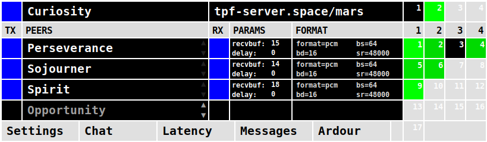

tpf-client
==========

About
-----

tpf-client is a low-latency multi-channel audio transmission software
based on the [AoO](https://git.iem.at/cm/aoo)  (Audio-over-OSC) protocol.
The received audio streams are made available on separate ports on the
[JACK](https://jackaudio.org/) server where they can be connected to an
JACK-aware DAW like [Ardour](https://ardour.org/) or an external mixing desk.
tpf-client's layout is configurable. The maximum of channels per peer and also
the number of peer slots can be adjusted so that different needs are covered.
It supports streaming in PCM and OPUS and the formats are also configurable.

You can download the client from:

  https://github.com/zhdk/tpf-client

The server software is hosted separately at:

  https://github.com/zhdk/tpf-server

#### NOTE:
tpf-client is not yet considered stable, because AoO is not released
and still subject to change.  Altough tpf-client already works well, the current
development version might not be compatible with the released version.

There is also an [older tpf-client](https://github.com/zhdk/tpf-client/releases/tag/v1.1.1)
based on the jacktrip protocol available.

Prerequisites
-------------

Make sure to get the latest Pure Data from:

  https://puredata.info/downloads/

You need the following externals to run tpf-client
  * aoo
  * command

You can install externals through the Pd menu:
'Help' -> 'Find Externals'

#### NOTE:
There is no release of the aoo version used by tpf-client. The beta versions
of tpf-client are based on the most recent [AoO developments](https://git.iem.at/cm/aoo/-/tree/develop).

Usage
-----

#### Run

To run the client, open the patch tpf-client.pd in Pure Data. Typically,
you run Pd with jack as audio backend, so that you can send audio from
and to the tpf-client to other software. When running from the command-
line, the recommended parameters are:

~~~sh
pd -rt -jack -inchannels 8 -outchannels 65 -nojackconnect \
     -jackname tpf-client -open tpf-client.pd
~~~

#### Configure

Before anything, open 'Settings' and configure the fields in the 'Connection
parameters' section. If you don't know about a server, you can run your own
(see [here](https://github.com/zhdk/tpf-server/) for details).

All parameters in the 'Audio Parameters' section take immediate effect, even
when the streaming is already running. You can either send your audio
compressed - encoded with [OPUS](https://opus-codec.org/) audio codec - or
uncompressed as [PCM](https://en.wikipedia.org/wiki/Pulse-code_modulation)
encoded.

#### Connect

The client connects to the server by clicking the top left button. Blue indicates
connection is established. Red indicates that some error occured. The name used
for each client connected to the same server must be unique. If the conncection
is successfull, other clients connected to the same room are listed in the
client rows below 'peer nodes'. To establish an audio transmission, either side
needs to initiate the connection by clicking the black square in the left and
the other side has to confirm by clicking the flashing yellow button.
Once the audio connection is established, the corresponding button turns blue
and the numbered squares indicate the number of received channels and the audio
level of each. The numbers on the channel indicators correspond with the numbers
in the QJackCtl connection dialog.

#### Transmission mode

tpf-client supports two transmission modes. The first transmits all audio data
through the server which relays streams between clients. The second mode uses
[UDP hole punching](https://en.wikipedia.org/wiki/UDP_hole_punching) for
establishing a direct peer-to-peer connection between two clients. Since the
peer-to-peer mode doesn't put any load onto the server and usually means lower
latency, it is the preferred mode. However, not in all network environments
it is possible to use peer-to-peer mode. tpf-client automatically detects
whether peer-to-peer mode is available for a certain connection and falls back
to server relay mode if it is not. This evaluation happens for any set of two
clients independently. When streaming to more than one peer, it is possible
that both modes are used simultaneously.

Ready-to-use macOS app
----------------------

If your computer runs macOS, you may download a self-contained
application bundle from:

  https://github.com/zhdk/tpf-client/releases

Bugs
----

For any bug, issue, or suggestion, please open an issue
[here](https://github.com/zhdk/tpf-client/issues).

Authors
-------

  * Roman Haefeli <roman.haefeli@zhdk.ch>
  * Johannes Schütt <johannes.schuett@zhdk.ch>

License
-------

  GPL 3.0 (see LICENSE.txt)

