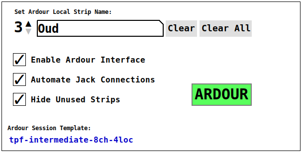

# Ardour Integration

## tpf-client's Ardour Panel

### Enable Ardour Interface
If this checkbox is enabled, tpf-client tries to communicate with Ardour
through its OSC interface (which must be enabled in Ardour, of course).
If tpf-client is able to talk Ardour, it does indicate so by 

## Automatic JACK connections
### From Ardour to tpf-client
All strips from the group `to_TPF` are connected to the inputs of
tpf-client until either the strips of the group named `to_TPF` or
the input channels of tpf-client are depleted.

## From tpf-client to Ardour
All outputs from the peer of the first slot are connected to the
inputs of the strip named LOC-A, the outputs of the seconds slot
to inputs of the strip named LOC-B, etc. This happens for each
peer slot until either the input channels of the strip in Ardour
or the number of outputs in tpf-client is depleted. Also, this
happens for as many peer slots as are available or as many input
strips following the LOC-X name scheme as are available.

## How tpf-client identifies Ardour strips for labelling and hiding/showing

### Group Inputs
The first two groups of strips is identified by their group name, namely
`Inputs`. Individual channels are identified by their strip ID. tpf-client
applies the labels that can be configured in the Ardour panel to the
strips of this group

### Group to_TPF
The mechanism for identifying those strips is based on group membership.
Strips that are members of the group `to_TPF` are considered
input channels for tpf-client.

### Peer strips (LOC-A, LOC-B, etc.)
The peer strips (the ones that collect all channels from a peer output
of tpf-client) are identified by their strip name. tpf-client assumes
the following naming convention:
  * LOC-A
  * LOC-B
  * LOC-C
  * etc.
tpf-client uses the strip's group label to display the peer's name.

### Strips in the Mixer group
The group `Mixer` collects all channels from tpf-client's outputs. They
carry the individual signals received from remote peers (as opposed to the
strips of the previous section which carry all signals of a remote  peer in
one multi-channel strip). tpf-client applies the labels which remote peers
set to their own channels to those strips. tpf-clients determines the signal
source by following the JACK connections. Each channel is identified by the
multichannel strip its input is connected to (remote peer) and its position
therein (nth channel of remote peer x).

